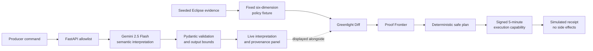

# ActionSlate — Agentic Release Assurance

[](https://haiec.replit.app/)
[](https://www.python.org/)
[](https://ai.google.dev/gemini-api/docs/models)
[](https://cloud.google.com/vertex-ai)
[](threat_model.md)
[](#verified-validation)
[](LICENSE)

> **The agent can execute more than the available evidence authorizes.**

ActionSlate is a control-boundary demonstration for consequential media agents.
It lets Gemini interpret what a producer means, but it does not let the model
decide what is allowed. For the fixed Eclipse scenario, a deterministic policy
fixture evaluates six predefined release-risk dimensions and produces an
inspectable safe plan.

**Gemini interprets. Evidence decides. Execution remains simulated.**

Built for the **Google Cloud Agentic Cinema: The Blockbuster Hackathon** in the
**Replit partner track**.

- **Live demo:** <https://haiec.replit.app/>
- **Repository:** <https://github.com/subodhkc/ActionSlate-Agentic-Release-Assurance>
- **Security model:** [`threat_model.md`](threat_model.md)

---

## The uncomfortable question

Suppose a studio agent receives this instruction:

> Launch the Eclipse Protocol trailer worldwide tonight. Localize it for France
> and Spain using Ava's voice, then maximize paid reach.

It sounds like one request.

It is not.

The sentence quietly contains decisions about:

1. which asset version may be released;
2. which territories are authorized;
3. whether the release window is open;
4. whether Ava's digital voice rights cover this specific use;
5. whether generated derivatives have valid provenance; and
6. how much campaign spend the agent is allowed to control.

A capable agent can infer missing details and operate faster than a human team
can inspect them. That is useful—until technical capability is mistaken for
authorization.

The central problem is therefore not:

> Can the agent perform the task?

It is:

> Which exact parts of the task are supported by current evidence?

That difference is the reason ActionSlate exists.

---

## The Eclipse Protocol test case

ActionSlate uses one intentionally instrumented scenario so the complete control
path can be inspected instead of hidden behind a broad product mockup.

### Available evidence

| Evidence dimension | Current fact | Source | State |
|---|---|---|---|
| Release master | V12 is approved; V13 remains internal review | Release registry and editorial queue | Verified / limited |
| Territory | US and Canada are currently authorized | Territory release ledger | Verified |
| Timing | Tonight is outside the current release window | Release calendar | Limited |
| Voice rights | Ava's trailer-specific intended use is not established | Rights and likeness ledger | Missing |
| Campaign authority | Autonomous spend is capped at $5,000 | Delegated authority policy | Verified |
| Derivative provenance | Localized/generated derivatives require lineage | Media provenance policy | Verified |

**Why does V13 appear if the producer did not name a version?** V13 is a
seeded scenario premise: it represents an upstream asset resolver presenting
the latest internal-review artifact as the candidate action input. It is not
claimed to come from the producer command or Gemini. The fixture tests whether
the release boundary rejects that contextual candidate in favor of the approved
V12 master.

### Deterministic Greenlight Diff

| Consequential dimension | Scenario action | Evidence says | Decision |
|---|---|---|---|
| Asset identity | V13 internal-review artifact | V12 is the approved master | `BLOCK` |
| Territory | Global release | US + Canada only | `BLOCK` |
| Timing | Tonight | Outside the authorized window | `REVIEW` |
| Ava voice use | Trailer-specific localization | Intended-use proof is absent | `UNKNOWN` |
| Campaign authority | Maximize paid reach | $5,000 delegated maximum | `REVIEW` |
| Derivative provenance | Generated localized derivatives | Provenance required before distribution | `REVIEW` |

`UNKNOWN` is never treated as approval.

### Deterministic Eclipse safe subset

The fixed Eclipse policy does not reduce the result to a generic denial. Its
deterministic safe-plan fixture preserves the evidence-backed work:

- stage the **V12 approved master**;
- constrain the release plan to **US + Canada**;
- cap the campaign envelope at **$5,000**;
- hold V13, global distribution, France and Spain, Ava voice use, and
  provenance-dependent derivatives;
- create a capability-gated, simulation-only Greenlight Receipt.

The result is useful progress without silent authority expansion.

---

## What ActionSlate offers

ActionSlate is a reference implementation of **evidence-bounded agency**:

- **Intent decomposition** — Gemini converts a compound producer request into
  typed consequential actions and arguments.
- **Argument provenance** — each consequential value is marked as explicit,
  contextual, inferred, defaulted, or unknown.
- **Evidence comparison** — a deterministic Eclipse fixture compares six
  predefined scenario dimensions with authoritative studio facts.
- **Greenlight Diff** — the interface shows the proposed value, available
  evidence, decision, and consequence side by side.
- **Proof Frontier** — missing proof is named explicitly, including the next
  evidence required and its expected source.
- **Capability boundary** — the product distinguishes what the agent can do from
  what it is currently authorized to do.
- **Safe-plan demonstration** — the fixed scenario preserves supported work
  while unsupported work is held.
- **Assurance-bound simulation** — receipt generation requires a short-lived,
  signed capability issued by a successful assurance run.
- **Inspectable behavior** — the evidence, policy rules, API models, tests, and
  UI states are all visible in this repository.

---

## Why this is different from regular governance software

Many governance products focus on inventories, policy documents, model cards,
access reviews, or after-the-fact audit reporting. Those functions matter, but
they do not necessarily answer the operational question that appears at agent
runtime:

> Is this exact action, with these exact arguments, supported by evidence now?

| Conventional governance pattern | ActionSlate |
|---|---|
| Governs a model, user, or application as a whole | Demonstrates argument-level review across six predefined Eclipse dimensions |
| Relies on policy declarations and workflow approvals | Compares proposed scope with concrete evidence facts |
| Produces pass/fail or a human review queue | Preserves a deterministic safe subset for the instrumented scenario |
| Treats missing information as an exception | Represents missing proof explicitly as `UNKNOWN` |
| Reviews behavior before or after execution | Creates a control boundary immediately before action |
| May trust the model to classify its own safety | Keeps final authorization in deterministic code |
| Focuses on whether a tool is available | Separates tool capability from delegated authority |

ActionSlate is not a replacement for enterprise GRC, IAM, rights management, or
content provenance systems. It is the decision layer that can sit between an
agent's plan and those systems' evidence.

---

## Architecture and workflow



### What is live

- a real `google-genai` request;
- Gemini 2.5 Flash through Vertex AI;
- structured semantic action decomposition;
- measured request-to-response latency;
- argument-provenance output returned by Gemini.

### What is deterministic

- the seven-item Eclipse evidence pack;
- `ALLOW`, `REVIEW`, `BLOCK`, and `UNKNOWN` policy outcomes;
- the capability-versus-greenlight conclusion;
- Proof Frontier requirements;
- the fixed Eclipse safe-plan fixture.

### What is simulated

- external publishing;
- localization and voice generation;
- campaign creation and ad buying;
- the final execution receipt.

No external action adapter exists in this project.

---

## Core assurance rules

These invariants define the control boundary:

1. **The model may interpret intent, but may not authorize it.**
2. **Evidence is never generated by the model.**
3. **Every consequential argument needs provenance.**
4. **`UNKNOWN` never becomes `ALLOW`.**
5. **The safe plan may only contain evidence-backed scope.**
6. **Blocked scope is not silently rewritten as approved scope.**
7. **Technical capability does not imply delegated authority.**
8. **Receipt generation requires a valid assurance capability.**
9. **Every external side effect remains disabled in this demonstration.**
10. **Assurance-run failures reset the interface to a non-actionable state.**
    Simulation failures preserve the already-assured plan so the user can retry.

The deterministic policy can be inspected in
[`app/assurance.py`](app/assurance.py).

---

## AI security and agent guardrails

ActionSlate was reviewed against OWASP LLM application risks and conventional
web-security surfaces.

### Prompt injection

- `/api/assure` accepts only the canonical Eclipse Protocol command.
- Validation occurs before a Gemini client is constructed.
- The accepted command is canonicalized before model submission.
- The command is JSON-encoded and passed as data beneath a separate system
  instruction.
- Gemini automatic function calling is explicitly disabled.
- There are no tools, retrieval sources, uploads, URLs, or external action
  adapters for injected instructions to reach.

### Excessive agency and overreliance

- Gemini performs semantic discovery only.
- The model cannot read or alter the evidence pack.
- The model cannot select final policy outcomes.
- Deterministic Python owns every Greenlight decision.
- Unsupported and unknown scope is excluded from the ready subset.
- A valid model response is not presented as proof that the requested action is
  authorized.

### Improper output handling

- Gemini returns a typed Pydantic response.
- Output is capped at 4,096 tokens.
- Action counts, nested values, lists, keys, descriptions, notes, provenance,
  and evidence requirements are bounded after parsing.
- Every argument must have exactly one provenance entry.
- Dynamic model content is HTML-escaped or assigned through `textContent`.
- Client-side response-shape checks fail closed.
- Content Security Policy blocks inline scripts and undeclared origins.

### Cost and availability controls

- five accepted requests per client per 60-second window;
- 20 accepted requests globally per process per 60-second window;
- maximum two concurrent Gemini calls per process;
- one-second concurrency acquisition timeout;
- bounded SDK retries;
- 40-second provider timeout;
- 45-second server timeout;
- `429` responses include `Retry-After`;
- API responses use `Cache-Control: no-store`.

Process-local limits are defense in depth, not a claim of distributed DDoS
protection. Shared edge enforcement would be required before broad public scale.

### Execution integrity

- successful assurance issues a five-minute HMAC-SHA256 capability;
- the capability is bound to `eclipse-safe-plan`;
- signatures use constant-time comparison;
- forged, modified, expired, or wrong-plan tokens are rejected;
- `/api/execute` cannot issue a receipt without a valid capability;
- the resulting receipt is still explicitly `SIMULATED`.

### Secrets and privacy

- `GOOGLE_API_KEY` and `SESSION_SECRET` remain in Replit Secrets;
- secret fields are excluded from object representations;
- credentials are not returned to the browser or committed;
- raw provider errors are sanitized;
- the app has no accounts, prompt retention, uploads, analytics, or durable
  personal-data store;
- a client host/address is held only in process memory for the 60-second rate
  window and disappears when it ages out or the process restarts;
- security headers restrict browser capabilities and referrer disclosure.

The complete assets, trust boundaries, residual risks, and required guarantees
are documented in [`threat_model.md`](threat_model.md).

---

## OWASP LLM coverage

| OWASP LLM risk area | ActionSlate control |
|---|---|
| Prompt injection | Exact scenario allowlist, canonicalized data prompt, separate system instruction, no tools |
| Sensitive information disclosure | Server-only secrets, sanitized failures, no credential fields in responses |
| Supply-chain risk | `uv.lock`, minimal dependency set, immutable CI action revisions, and a dated manual dependency audit |
| Data/model poisoning | No retrieval, mutable corpus, upload, fine-tuning, or external evidence ingestion |
| Improper output handling | Typed output, bounded validation, escaping, shape checks, CSP |
| Excessive agency | Interpretation-only model, deterministic policy, no action adapters |
| System prompt leakage | No secret or authority-bearing instruction is placed in the prompt |
| Vector/embedding weaknesses | Not applicable; no vector store or retrieval system |
| Misinformation/overreliance | Model output is labeled as interpretation and provenance, never evidence |
| Unbounded consumption | Replay limits, concurrency cap, token cap, retry limits, layered timeouts |

---

## Verified validation

The final security and product pass completed on **September 9, 2026**.

### Dated pre-submission security assessment

These scans were run manually in the Replit development environment on the
date above. They are not represented as CI jobs. Scanner names, scope, exact
counts, limitations, and reproducible local checks are recorded in
[`security_assessment.md`](security_assessment.md).

| Scanner | Result |
|---|---|
| Dependency vulnerability audit | 0 critical, high, moderate, low, or informational findings |
| Static application security testing | 0 findings |
| Security/privacy dataflow scan | 0 findings |
| Adversarial OWASP AI architecture review | PASS — no concrete exploitable blocker |

### Test suite

**14/14 tests pass**, covering:

- `UNKNOWN` is never approval;
- unsupported scope is excluded from the safe subset;
- receipts remain simulation-only;
- structured interpretation and argument provenance;
- non-canonical prompts are rejected before Gemini construction;
- favicon delivery;
- per-client replay limiting;
- process-global replay limiting;
- oversized prompt rejection;
- excessive action-count rejection;
- capability signature, plan binding, tamper rejection, and expiry;
- forged execution-capability rejection;
- valid capability-gated simulation;
- security headers and API `no-store`;
- sanitized provider failures.

### Manual live and browser validation

These checks exercise the configured Google runtime and browser and therefore
run separately from the secret-free local validation commands.

- real Gemini interpretation succeeded;
- all seven deterministic evidence facts were returned;
- Ava voice authorization remained `UNKNOWN`;
- credential fields were absent from the response;
- forged execution returned `403`;
- valid assurance-bound execution returned `200`;
- receipt status was `SIMULATED`;
- external side effects were `None`;
- browser flow completed without JavaScript or CSP errors;
- desktop and mobile layouts showed no horizontal overflow;
- pre-run states remained neutral until the user initiated the live call.

Run the local checks:

```bash
uv run python -m unittest discover -s tests -v
node --check app/static/app.js
```

These checks are also the recommended pre-commit validation path. The GitHub
connector used for this project does not have permission to create workflow
commits, so the repository does not claim a hosted CI status it cannot verify.

---

## Repository guide

```text
app/
├── agent.py          # Gemini system instruction and google-genai adapter
├── assurance.py      # fixed Eclipse evidence, decisions, and safe-plan fixture
├── config.py         # server-side runtime and secret configuration
├── main.py           # FastAPI routes, timeouts, headers, and API boundary
├── models.py         # typed request, interpretation, policy, and receipt models
├── security.py       # replay limits and signed execution capabilities
└── static/
    ├── app.js        # guarded client workflow and safe model-output rendering
    ├── favicon.svg
    ├── index.html
    └── styles.css
tests/
├── test_assurance.py
├── test_cycle1_models.py
├── test_demo_scope.py
└── test_security.py
threat_model.md       # STRIDE-inspired and OWASP LLM security reference
```

---

## Run on Replit

### Requirements

- Python 3.13+
- `uv`
- Replit Secrets:
  - `GOOGLE_API_KEY`
  - `SESSION_SECRET`

Do not place either value in source code or chat.

### Start the application

The repository includes a Replit workflow. You can also run:

```bash
uv sync --locked
uv run uvicorn main:app --host 0.0.0.0 --port 5000
```

Open the Replit web preview and select **Run live assurance**.

### Demo sequence

1. Start from the neutral `AWAITING RUN` state.
2. Select **Run live assurance**.
3. Watch the real Gemini interpretation complete.
4. Review argument provenance and consequential actions.
5. Inspect the seven evidence facts.
6. Walk through the Greenlight Diff.
7. Point out the Ava voice `UNKNOWN` Proof Frontier.
8. Review the bounded safe plan.
9. Select **Apply safe plan**.
10. Confirm the capability-gated, simulation-only receipt and zero external
    side effects.

---

## API usage

### Health

```bash
curl http://localhost:5000/health
```

### Assurance

Only the canonical Eclipse command is accepted:

```bash
curl -X POST http://localhost:5000/api/assure \
  -H 'content-type: application/json' \
  -d '{"producer_request":"Launch the Eclipse Protocol trailer worldwide tonight. Localize it for France and Spain using Ava'\''s voice, then maximize paid reach."}'
```

The response includes:

- structured Gemini interpretation;
- argument provenance;
- deterministic evidence and decisions;
- safe plan;
- runtime proof;
- short-lived `execution_token`.

### Capability-gated simulation

```bash
TOKEN="<execution_token returned by /api/assure>"

curl -X POST http://localhost:5000/api/execute \
  -H 'content-type: application/json' \
  -d "{\"plan_id\":\"eclipse-safe-plan\",\"execution_token\":\"$TOKEN\"}"
```

A missing, invalid, expired, or wrong-plan token returns `403`. Repeated
assurance requests may return `429` with `Retry-After`.

---

## Three-minute judging path

### 0:00–0:30 — State the contradiction

An agent may have the technical ability to publish globally, clone a voice, and
spend money. None of those capabilities prove that it has current authority.

### 0:30–1:00 — Trigger the live agent

Select **Run live assurance** and show the Gemini 2.5 Flash runtime proof,
measured latency, typed actions, and argument provenance.

### 1:00–1:45 — Reveal the hidden risk

Walk down the Greenlight Diff: wrong asset, unauthorized markets, closed timing
window, missing voice rights, spend beyond delegation, and incomplete
provenance.

### 1:45–2:15 — Show useful restraint

Explain that ActionSlate does not stop everything. It preserves V12, US and
Canada, and the $5,000 envelope while holding unsupported scope.

### 2:15–2:40 — Prove the execution boundary

Apply the safe plan and show the capability-gated simulation receipt. Explain
that forged or expired capabilities are rejected and no external adapter
exists.

### 2:40–3:00 — Close on value

Gemini provides semantic understanding. The fixed Eclipse policy fixture
demonstrates how deterministic evidence can provide authority. ActionSlate
makes that boundary visible, inspectable, and testable.

---

## Hackathon alignment

ActionSlate addresses a real Media & Entertainment bottleneck: release intent
often crosses editorial approval, territorial windows, performer rights,
provenance obligations, embargo timing, and delegated spend authority.

The project demonstrates:

- a **functional Gemini-powered agent**, not a static chatbot;
- a concrete **media release assurance workflow**;
- **Google Cloud Vertex AI** runtime use through `google-genai`;
- **Replit** development, secret management, workflow hosting, preview, and
  deployment;
- a transparent fixed-scenario demonstration of deterministic agent control;
- production-oriented security and failure handling;
- a public, MIT-licensed source repository;
- a hosted, judge-triggered live demonstration.

Relevant concepts represented naturally in the implementation include:

**agentic AI, AI security, responsible AI, AI governance, media and
entertainment, Gemini, Vertex AI, Google Cloud, Replit, deterministic policy,
human-review escalation, evidence-based authorization, least agency, prompt-injection
defense, excessive-agency prevention, provenance, rights and likeness,
Greenlight Diff, safe-plan extraction, capability security, and OWASP LLM.**

Official event references:

- [Agentic Cinema: The Blockbuster Hackathon](https://agentic-cinema.devpost.com/)
- [Google Cloud and Devpost participant overview](https://info.devpost.com/blog/google-cloud-agentic-cinema-hackathon)

---

## Scope and honest limitations

ActionSlate is a focused assurance demonstration, not a complete studio control
plane.

It intentionally excludes:

- databases and durable audit storage;
- user accounts and role-based access control;
- real publishing, advertising, or voice-generation adapters;
- C2PA signing;
- additional scenarios;
- analytics and prompt retention;
- distributed edge-rate-limit infrastructure;
- deployment to an agent runtime.

The execution capability is appropriate for a simulation. Any future real
action adapter would additionally require authenticated identities,
action-level authorization, one-time capability consumption, durable audit,
replay protection across instances, and independent production security review.

---

## License

MIT. See [`LICENSE`](LICENSE).

---

## Author

**Subodh KC**<br>
AI Security Architect<br>
[subodhkc.com](https://subodhkc.com)

---

*ActionSlate was built for the Google Cloud Agentic Cinema: The Blockbuster
Hackathon — Replit partner track.*